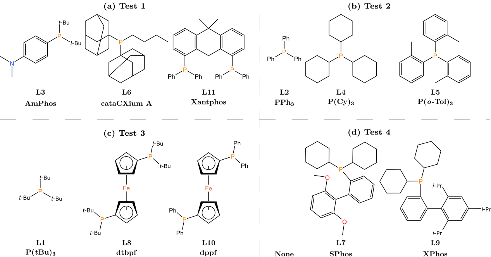

# ReaMVP

Data and codes for the paper "Prediction of Chemical Reaction Yields with Large-Scale Multi-View Pre-training".

## Requirements

We implement our model on `Python 3.10`. These packages are mainly used:

```
rdkit                2022.9.5
torch                2.0.0+cu118
tensorboard          2.12.2
dgl                  1.0.2+cu117
numpy                1.24.2
scikit-learn         1.2.2
```

## Datasets

### Pre-training dataset

We filtered reactions from USPTO and CJHIF. Related codes are stored in `data_utils`. You can download USPTO from https://figshare.com/articles/dataset/Chemical_reactions_from_US_patents_1976-Sep2016_/5104873 and CJHIF from https://github.com/jshmjs45/data_for_chem.

### Downstream dataset

We finetuned our model on two downstream datasets. Most of the data that has been split is publicly available. We use the same split as previous works if possible.  Related data for the Buchwald-Hartwig dataset and the Suzuki-Miyaura dataset is stored in `data/BH` and `data/SM`, respectively.

For the Suzuki-Miyaura dataset, run `downstream/SM_split.py` to generate custom data. We define four groups of out-of-sample splits:



**Figure:** Ligands used in out-of-sample splits for the Suzuki-Miyaura dataset.

## Experiments

### Pre-training

Run `pretraining_stage1.py` and `pretraining_stage2.py` to pre-train ReaMVP in two stages, respectively. For example,

```
python pretraining_stage1.py --seed 511 --device 0 --supervised 0 --epochs 30 --batch_size 256 --lr 0.001 --lr_type cos --T 1.0 --data_path ../data/pretraining_data/pretraining_cl

python pretraining_stage2.py --seed 511 --device 0 --supervised 1 --data_type rnn_geo --epochs 20 --batch_size 256 --lr 0.0001 --lr_type step --milestones 20 --save 0 --predictor_bn 0 --mlp_only 0 --loss_type mse --data_path ../data/pretraining_data/pretraining_yield
```

The pre-trained models for stage 1 and stage 2 are stored in `checkpoint`. We provide the model with the sequence encoder alone (rnn), the conformer encoder alone (geo), and the concatenation of their outputs both (rnn_geo), respectively.

### Fine-tuning

Run `downstream/prepare_data.py` to generate the input of the Buchwald-Hartwig dataset and the Suzuki-Miyaura dataset.

Run `downstream/training.py` to fine-tune ReaMVP on a given downstream dataset. For example,

```
python downstream/training.py --ds SM_test1 --device 0 --data_type rnn_geo --batch_size 128 --supervised 1 --lr 1e-3 --lr_type step --weight_decay 0 --predictor_dropout 0.1 --predictor_num_layers 2 --gamma 0.3 --milestones 100 --epochs 50 --save 0 --normalize 0 --loss_type mse --cl_weight 1. --kl_weight 1. --predictor_bn 0 --repeat 5
```


